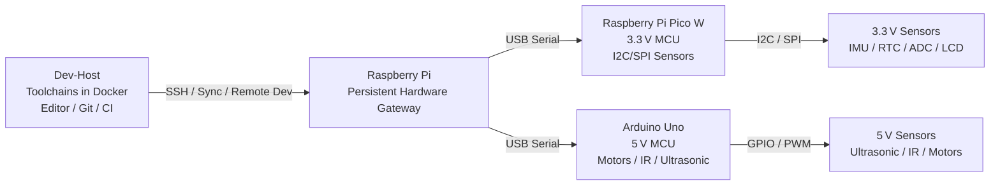
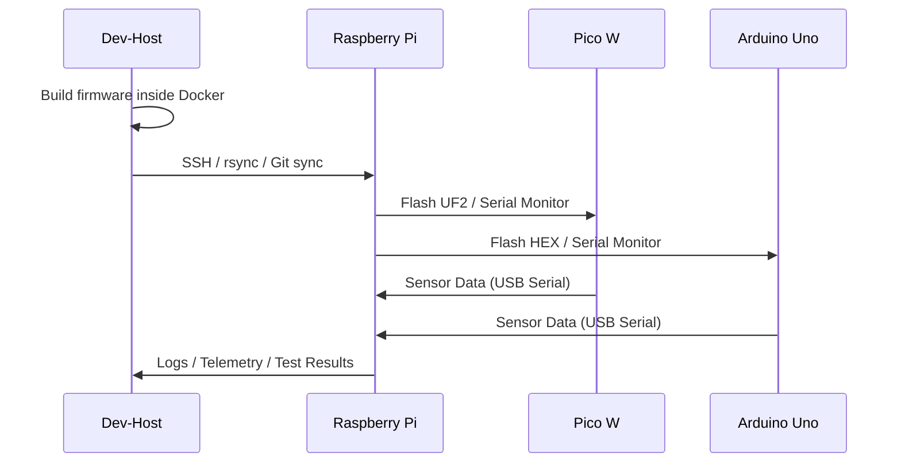
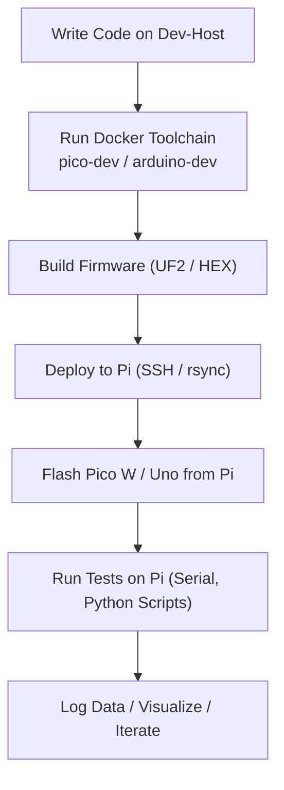

# Development Environment Design Document  
**Dev‑Host–Centric Embedded Systems Lab**  
**Raspberry Pi as Persistent Hardware Gateway**  
**Pico W (3.3 V) + Arduino Uno (5 V) as MCU Targets**  
**Docker‑Packaged Toolchains for Reproducibility**

---

## 1. Overview

This document defines a structured, engineering‑grade development environment for a modular embedded systems lab built around a **three‑tier architecture**:

1. **Dev-Host** — primary development machine: editor, cross‑compiler, Docker toolchains, Git source‑of‑truth (workstation, NUC, VM, or CI agent—not a specific form factor)  
2. **Raspberry Pi** — persistent embedded gateway and hardware access node  
3. **Pico W + Arduino Uno** — real‑time microcontroller targets for 3.3 V and 5 V domains  

Docker is used to encapsulate all build tools, compilers, SDKs, and utilities to ensure reproducible builds across machines and over time.

### 1.1 Unified container-first embedded bootstrap (north star)

Product direction is a **single pipeline** shared across gateway targets: **build container artifacts → validate each layer → deploy a bootable image or bundle → run workloads on real hardware with gated checks**. Raspberry Pi is the **reference profile** today; other boards (e.g. BeagleBone) map onto the **same stages** with profile-specific OS images and bootstrap injectors—not separate ad-hoc flows.

See **[docs/CONTAINER_BOOTSTRAP.md](docs/CONTAINER_BOOTSTRAP.md)** for stages, validation gates, and how existing `lab/docker/` and `lab/pi/` pieces fit. For **what boots on a PC vs on a Pi** (disk image vs OCI), see **[docs/BOOT_IMAGES.md](docs/BOOT_IMAGES.md)**.

---

## 2. Design Philosophy

CEDE is organized around **roles and contracts**, not particular brands of PC. The naming **Dev-Host** keeps the architecture honest when the “laptop” is a desktop, a shared build server, or headless CI.

**Principles:**

- **Host‑agnostic dev tier** — The Dev-Host is whatever machine runs the editor and containerized toolchains. The same Docker images should run on a developer machine and in automation.  
- **Reproducibility over one‑off setup** — Compilers, SDKs, and OS packages are version‑pinned; lab layout and config files are the single place for hostnames, serial devices, paths, and (later) metrics.  
- **Gateway stability** — The Raspberry Pi remains connected to USB hardware, serial, and sensors. The Dev-Host can disconnect; the lab’s physical interface to MCUs does not.  
- **Explicit contracts** — Line formats on serial, file layout under `lab/`, and bring‑up tests are part of the product, not private notes.  
- **Staged complexity** — Prove toolchains, SSH, and serial echo before I2C sensors, dashboards, and OTA. Optional services (MQTT, Grafana) stay opt‑in.  
- **Testability** — Every stage has automated or scripted checks (with clear “skip if no hardware” behavior) so regressions are visible.  
- **Tests as system and target validation** — The test suite is the primary way to confirm **correctness and availability** across tiers: the Raspberry Pi gateway (e.g. SSH and orchestration), and each MCU target (Pico, Uno) via discovered serial devices. Absent hardware yields explicit skips or structured “not present” outcomes—never ambiguous silence.

These principles drive documentation, config schema, and the order of implementation (toolchains → Pi gateway → MCUs → sensors).

---

## 3. High‑Level System Architecture



---

## 4. Roles and Responsibilities

### 4.1 Dev-Host (Primary Development Machine)

**Responsibilities:**
- Code editing (VS Code, Vim, CLion, or headless editor on a build agent)
- Docker‑based toolchains for:
  - Pico W (Pico SDK + ARM GCC)
  - Arduino Uno (avr‑gcc + avrdude)
  - Python tooling
- Git repository management
- Documentation authoring
- Running simulators/emulators
- Running test harnesses (local or CI/CD)

**Why:**  
The Dev-Host typically has more CPU/RAM and better tooling than the Pi; it is the natural “source of truth” for the repository. The same role can be played by a CI runner using the same Docker images.

---

### 4.2 Raspberry Pi (Persistent Hardware Gateway)

**Responsibilities:**
- Always‑on SSH endpoint
- USB host for Pico W + Uno
- Serial bridge for MCU communication
- Running Python orchestration scripts
- Logging sensor data
- Hosting dashboards (Grafana/InfluxDB)
- Optional: MQTT broker, REST API
- Optional: OTA update server for Pico W

**Why:**  
The Pi stays physically connected to all hardware, even when the Dev-Host disconnects.

---

### 4.3 Pico W (3.3 V MCU)

**Responsibilities:**
- 3.3 V sensor integration
- I2C/SPI bring‑up
- High‑speed GPIO tasks
- PIO‑based custom protocols
- Optional WiFi telemetry

**Languages:**  
- MicroPython (rapid prototyping)  
- C/C++ SDK (performance)

---

### 4.4 Arduino Uno (5 V MCU)

**Responsibilities:**
- 5 V sensor integration
- Motor control
- IR TX/RX
- Ultrasonic ranger
- Legacy 5 V peripherals

**Languages:**  
- Arduino C++  
- PlatformIO builds

---

## 5. Communication Architecture



---

## 6. Docker‑Based Toolchain Packaging

### 6.1 Goals

- Reproducible builds  
- Identical toolchains across Dev-Host, Pi, and CI  
- Zero “works on my machine” issues  
- Version‑locked compilers and SDKs  
- Easy onboarding for new developers  

---

### 6.2 Docker Images

You will maintain **three primary images**:

#### **1. pico-dev**
Includes:
- ARM GCC toolchain  
- Pico SDK  
- CMake + Ninja  
- picotool  
- Python for MicroPython utilities  

#### **2. arduino-dev**
Includes:
- avr‑gcc  
- avrdude  
- PlatformIO (optional)  
- Arduino CLI  

#### **3. orchestration-dev**
Includes:
- Python 3  
- pyserial  
- MQTT client libs  
- Test harness scripts  
- Data logging tools  

---

### 6.3 Docker Workflow



---

### 6.4 Directory Structure

```
cede_labgrid/             # custom LabGrid drivers + strategies (§10)
  drivers/
  strategies/
env/                      # LabGrid environment configs (remote.yaml, exporter)
lab/
  docker/
    pico-dev/               # Pico SDK + ARM GCC
    arduino-dev/            # avr-gcc + avrdude
    orchestration-dev/      # Python + labgrid + test harness
    rpi-imager/             # containerised SD card imaging
    docker-compose.yml
    docker-compose.gateway.yml
  pico/
    hello_lab/              # minimal Pico W firmware (CMake)
    lab_stack/              # multi-target Pico application
  uno/
    hello_lab/              # minimal Uno sketch (Arduino CLI)
    lab_stack/              # multi-target Uno application
  pi/
    bootstrap/              # gateway installer + cloud-init helpers
    cloud-init/
    docs/
    native/hello_gateway/   # aarch64 native binary for the gateway
    scripts/
    services/
    ssd1306_dual/           # dual SSD1306 OLED display test
    ssd1306_eyes/           # SSD1306 animated display
  sensors/
  tests/
```

---

## 7. Bus Architecture

### 7.1 Pico W (3.3 V Domain)

- **I2C:** IMU, RTC, current/voltage sensor, environmental sensors  
- **SPI:** LCDs, LED drivers, ADC/DAC, radar modules  
- **PIO:** custom protocols, high‑speed LED driving  

### 7.2 Arduino Uno (5 V Domain)

- **GPIO/PWM:** motors, IR, ultrasonic, 5 V LCDs  
- **Analog:** 5 V analog sensors  

### 7.3 Raspberry Pi

- USB host for MCUs  
- Optional direct I2C/SPI for Pi‑native sensors  
- **Hello Lab (§9):** the Pi’s I2C controller acts as **master** to each MCU (**Pi → Pico**, **Pi → Uno**) on the shared harness, alongside USB serial programming  

### 7.4 Inter‑tier I2C (Hello Lab)

- Bring‑up validates I2C **from the gateway to each MCU** (Pi as master), not only sensors on a single board.  
- **3.3 V vs 5 V:** pairs that require **level shifting** or are **electrically unsafe** are marked **N/A** in lab config; the test suite runs only **enabled** matrix cells.  
- **Sensors** on those buses are a **post–bring-up** concern (§9 scope).  

---

## 8. Serial Communication Protocol

### Transport
- USB CDC serial  
- 115200 baud  
- Line‑based messages  

### Message Formats

**Key‑value:**
```
TEMP:23.4
DIST:118
```

**JSON:**
```
{"imu":{"ax":0.12,"ay":0.03,"az":9.81}}
```

**Command/Response:**
```
CMD:READ_IMU
RESP:{"imu":{"ax":0.12,"ay":0.03,"az":9.81}}
```

---

## 9. Bring‑Up Test Plan (“Hello Lab”)

**Scope:** “Hello Lab” proves the **Raspberry Pi** can **program** the Pico and Uno, carry a **serial data path** to each MCU, and exercise **I2C** from the **Pi as master** to **each** MCU on the shared harness (addresses and wiring per lab config and [`lab/pi/docs/bus-wiring.md`](lab/pi/docs/bus-wiring.md)). **Physical sensors** (IMU, rangefinders, etc.) are **out of scope** for Hello Lab—they belong to a **post–bring-up sensor integration** phase after the bus and endpoints are trusted.

**Out of scope (post bring-up):** Attaching and validating real sensor chips and drivers; dashboards; long‑term logging. Those build on the same contracts once Hello Lab passes.

### 9.1 Target firmware identity — `digest=` on the USB serial banner

**Purpose:** Hello Lab firmware on each MCU prints a **stable, machine‑readable identity** on its USB CDC serial line (alongside the human‑readable “hello” status). The **`digest=<id>`** field exists so automated gates can **prove the device under test is running the specific firmware artifact** the pipeline just built or flashed—not an older UF2/HEX left on disk, a partial flash, or a board that never rebooted into the new image.

**Contract (conceptual):**

- **Embed at build time:** `<id>` is derived from the repository (e.g. short git hash) or from an explicit **`CEDE_IMAGE_ID`** / smoke **`CEDE_TEST_IMAGE_ID`** so each CI or bench run can request a **unique** token when needed.  
- **Expose at runtime:** The running firmware prints a line that includes **`digest=<id>`** on the USB serial banner (same transport as §8).  
- **Assert in validation:** Dev‑Host and Pi scripts read the banner and compare **`digest=`** to the **expected** value for that step (Makefile **`DIGEST`**, **`--digest`** on serial validators, and matrix flows that re‑read USB after I2C checks). A mismatch fails fast instead of attributing bus or sensor errors to the wrong binary.

This is **version assurance for the target image**, not cryptographic signing: it ties **observed runtime behavior** to **the intended build identity** for repeatability and regression isolation. Operational detail, smoke targets, stale‑`DIGEST` caveats, and the **validation command checklist** (workspace, gateway, MCUs, I2C, gateway native, smoke) live in **[lab/docs/staged-bootstrap.md](lab/docs/staged-bootstrap.md)**. **Daily development preflight** (`make cede-dev-preflight`): **[lab/docs/dev-preflight.md](lab/docs/dev-preflight.md)**. **Full E2E bench validation** (copy-paste script: Docker **`CEDE_IMAGE_ID`**, **`pi-gateway-flash-test-*`**, I2C matrix): **[lab/docs/staged-bootstrap.md](lab/docs/staged-bootstrap.md)** (*Copy-paste: end-to-end bench validation*). **Multi-target applications** (`hello_lab`, `lab_stack`, manifests, `applications` in lab config): **[lab/docs/applications.md](lab/docs/applications.md)**. Flash/resolve details: **[lab/pi/docs/pico-uno-subtargets.md](lab/pi/docs/pico-uno-subtargets.md)**.

### Test 1 — Dev-Host ↔ Pi SSH  
- Confirm remote editing and file sync

### Test 2 — Docker Toolchain Build  
- Build Pico and Uno firmware inside containers on the Dev-Host

### Test 3 — RPi Programs Pico  
- From the Pi, flash firmware to the Pico (UF2 / picotool as applicable)  
- Confirms programming path and device discovery from the gateway  

### Test 4 — RPi Programs Uno  
- From the Pi, flash firmware to the Uno (avrdude / Arduino CLI as applicable)  
- Confirms programming path and port resolution (**including stable `/dev/serial/by-id/usb-Arduino*`** when enumeration allows)  
- *Reference tooling:* Makefile **`make pi-gateway-flash-test-uno`** (Dev-Host **`ssh`** to gateway: minimal **`lab/pi`** sync, HEX transfer, **`avrdude` verify**, optional serial banner probe); offline **`pytest lab/tests/test_uno_gateway_env.py`** mocks resolver logic. Pytest **`test_flash_uno_from_pi`** remains a hardware scaffold until Pi‑hosted automation is wired.  

### Test 5 — RPi ↔ Pico Serial (Data Path)  
- With firmware whose identity is confirmed (**§9.1** **`digest=`** attestation), open USB serial and validate **round‑trip** line or framed messages  
- Confirms data plane between Pi and Pico  

### Test 6 — RPi ↔ Uno Serial (Data Path)  
- Same for the Uno: round‑trip on the configured serial device, again after **§9.1** attestation so the serial path is exercised on the **intended** image  
- Confirms data plane between Pi and Uno (**`hello_lab.ino`** prints **`CEDE hello_lab ok`** with **`digest=<id>`** @ 115 200 baud for scripted checks alongside Test 4 tooling)  

### Test 7 — I2C matrix (Pi → Pico, Pi → Uno)  
- For each **enabled** row in the lab’s **`i2c_matrix`** where the **Raspberry Pi** is **I2C master** (`rpi_master_i2cdev_read`), run a **register peek** (e.g. **`i2cget`**) on the configured bus and **7‑bit address**, then (where configured) confirm the matching MCU’s **USB serial banner** and **`digest=`** so the live image matches the expected firmware  
- **Pico↔Uno** as **I2C master** over the harness is **out of scope** for the automated matrix; **Pi → each MCU** already validates the shared bus and level shifting. Optional manual **`m`** probes in **hello_lab** firmware remain for bench use only  
- **Level shifting** and **common ground** between 3.3 V and 5 V domains are assumed per the lab’s wiring document ([`lab/pi/docs/bus-wiring.md`](lab/pi/docs/bus-wiring.md)); tests assert behavior, not board safety—mark unwired or unsafe pairs **N/A** in config  

---

## 10. LabGrid Integration

CEDE uses [LabGrid](https://labgrid.readthedocs.io/) (>=25.0, gRPC) as the hardware orchestration layer, replacing direct SSH/rsync/scp Make targets for flash and validation workflows.

### Architecture

- **Coordinator**: runs in the `orchestration-dev` Docker container on the Dev-Host
- **Exporter**: runs on the Raspberry Pi gateway, exporting USB serial ports (Pico, Uno) via udev match
- **Client/pytest**: runs in Docker on the Dev-Host; tests use `pytest --lg-env env/remote.yaml`

### Custom extensions (`cede_labgrid/`)

| Component | Description |
|-----------|-------------|
| `PicotoolFlashDriver` | UF2 flash via BOOTSEL mass-storage on the Pi (picotool reboot + cp) |
| `AvrdudeFlashDriver` | HEX flash via avrdude on the Pi |
| `CedeValidationDriver` | Serial banner + `.digest` sidecar attestation (replaces `FIRMWARE_DIGEST` plumbing) |
| `CedeStrategy` | GraphStrategy: `off` -> `flashed` -> `validated` |

### Firmware attestation

Build artifacts (UF2, HEX) are accompanied by a `.digest` sidecar file containing the embedded build token. The `CedeValidationDriver` reads the sidecar and compares with the `digest=` field in the serial banner. This replaces the `FIRMWARE_DIGEST` / `CEDE_TEST_IMAGE_ID` / `CEDE_EXPECT_DIGEST` environment-variable plumbing.

### Configuration files

- `env/remote.yaml` -- LabGrid environment (targets, drivers, images, imports)
- `env/cede-pi-exporter.yaml` -- exporter config for the Pi (USB serial resource groups)

---

## 11. Future Extensions

- OTA updates for Pico W  
- Distributed sensor nodes via MQTT  
- Unified dashboard for all sensor streams  
- Multi‑MCU synchronization  
- Additional LabGrid targets (BeagleBone, ESP32)  
- CI pipeline with LabGrid coordinator in GitHub Actions  

---

# End of Document

