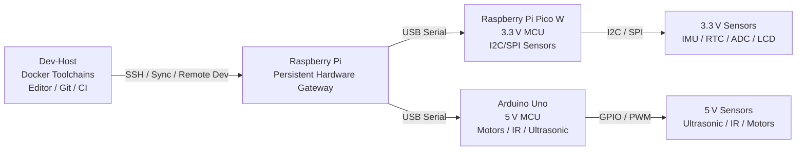
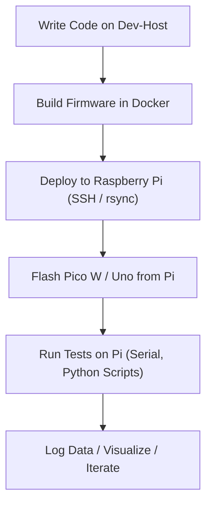

# Containerized Embedded Development Environment (CEDE)

**Build firmware in Docker, flash it through a Raspberry Pi gateway, and validate the result -- all from one repo with automated checks at every stage.**

CEDE is a modular, reproducible, and containerized embedded systems development environment designed for multi‑MCU hardware experimentation.  
It provides a **Dev-Host–centric toolchain** (workstation, NUC, VM, or CI), a **hardware gateway** (Raspberry Pi as the current reference), and **Pico W + Arduino Uno** microcontroller targets across 3.3 V and 5 V domains.

> **Quick start:** `uv sync && make validate` runs the offline test suite. See [section 5](#5-docker-toolchains-dev-host) for Docker toolchain setup and [lab/docs/staged-bootstrap.md](lab/docs/staged-bootstrap.md) for the full bring-up checklist.

**Deep dives:** [docs/CONTAINER_BOOTSTRAP.md](docs/CONTAINER_BOOTSTRAP.md) (pipeline stages and validation gates) · [docs/BOOT_IMAGES.md](docs/BOOT_IMAGES.md) (PC vs Pi boot artifacts) · [docs/BOOT_MEDIA_FLASH.md](docs/BOOT_MEDIA_FLASH.md) (raw image flashing) · [docs/TOOLCHAINS.md](docs/TOOLCHAINS.md) (Docker images and cross-compilers) · [lab/pi/docs/labgrid-manual-flash.md](lab/pi/docs/labgrid-manual-flash.md) (LabGrid end-to-end walkthrough) · [CONTRIBUTING.md](CONTRIBUTING.md) (dev setup and test guide)

CEDE emphasizes:
- Reproducible builds via Docker
- Remote‑first development via SSH
- Multi‑MCU orchestration
- Clean separation of concerns
- Scalable hardware integration
- **Role‑based naming** (Dev-Host vs gateway vs targets)—see [DESIGN.md](DESIGN.md) §2
- **Tests that validate the system and target availability** (Pi gateway, Pico, Uno)—see [DESIGN.md](DESIGN.md) §2

---

## 1. Design philosophy (summary)

The full principles live in [DESIGN.md](DESIGN.md) §2. In short: the **Dev-Host** is any machine that runs editors and the same container images as CI; the **Raspberry Pi** is the stable USB/serial anchor for hardware; **contracts** (repo layout, serial formats, lab config, tests) are first‑class; **complexity is staged** (toolchains → gateway → MCUs → sensors). **Tests** are how we validate both behavior and **whether each target tier is available** (reachable Pi, enumerated Pico/Uno), using explicit skips when hardware is missing.

---

## 2. System Architecture

CEDE uses a **three‑tier architecture**:



### Roles

| Layer | Responsibilities |
|-------|------------------|
| **Dev-Host** | Code editing, Docker toolchains, cross‑compilation, Git, CI jobs using the same images |
| **Raspberry Pi** | Persistent hardware access, flashing MCUs, logging, orchestration |
| **Pico W** | 3.3 V sensors, SPI/I2C, PIO, real‑time tasks |
| **Arduino Uno** | 5 V sensors, motors, IR, ultrasonic, timing‑critical loops |

---

## 3. Features

### ✔ Reproducible Docker Toolchains
- Pico SDK + ARM GCC
- avr-gcc + avrdude
- PlatformIO (optional)
- Python orchestration environment

### ✔ Remote‑First Development
- SSH into Raspberry Pi
- VS Code Remote‑SSH support
- Serial monitoring from Pi

### ✔ Multi‑MCU Integration
- Pico W for 3.3 V domain
- Uno for 5 V domain
- Pi as USB host + orchestrator

### ✔ Clean Bus Architecture
- I2C/SPI on Pico W
- GPIO/PWM/analog on Uno
- USB serial for MCU‑to‑Pi communication

### ✔ LabGrid Hardware Orchestration
- [LabGrid](https://labgrid.readthedocs.io/) coordinator runs in the `orchestration-dev` Docker container on the Dev-Host
- `labgrid-exporter` on the Pi exports USB serial ports (Pico, Uno) via udev match
- Custom drivers: `PicotoolFlashDriver` (UF2 flash), `AvrdudeFlashDriver` (HEX flash), `CedeValidationDriver` (serial banner + digest attestation)
- `CedeStrategy` (GraphStrategy): `off` → `flashed` → `validated` state machine
- Firmware attestation via `.digest` sidecar files (replaces `FIRMWARE_DIGEST` env-var plumbing)
- `pytest --lg-env env/remote.yaml` replaces Make-based hardware smoke tests
- LabGrid runs alongside the legacy SSH/rsync `pi-gateway-*` Make targets; both pipelines coexist in the Makefile
- See `env/remote.yaml` (environment), `env/cede-pi-exporter.yaml` (exporter), `cede_labgrid/` (custom drivers/strategies)
- End-to-end manual walkthrough: [lab/pi/docs/labgrid-manual-flash.md](lab/pi/docs/labgrid-manual-flash.md)

---

## 4. Repository Structure

```
.github/workflows/        # CI (cede-smoke, docker-target-workflow)
cede_labgrid/             # custom LabGrid drivers and strategies
  drivers/
    picotool_flash.py       # PicotoolFlashDriver (UF2 via exporter)
    avrdude_flash.py        # AvrdudeFlashDriver (HEX via exporter)
    cede_validation.py      # CedeValidationDriver (banner + digest sidecar)
  strategies/
    cede_strategy.py        # CedeStrategy (GraphStrategy: off -> flashed -> validated)
docs/
  CONTAINER_BOOTSTRAP.md   # unified pipeline: containers → image deploy → hardware gates
  BOOT_IMAGES.md           # PC Dev-Host vs Pi: no repo PC ISO; Pi OS .img + cloud-init vs Docker OCI
  BOOT_MEDIA_FLASH.md      # dd raw/hybrid images to SD, USB, HDD/NVMe (export-raw-dd)
  TOOLCHAINS.md            # Docker images, cross-compilers, version pins, validation gates
env/                      # LabGrid environment configs
  remote.yaml               # Dev-Host Docker -> Pi exporter via coordinator
  cede-pi-exporter.yaml    # exporter config for Pi (USB serial resources)
lab/
  config/
    lab.example.yaml
    lab.schema.json
  docker/
    pico-dev/
    arduino-dev/
    orchestration-dev/      # includes labgrid>=25.0
    rpi-imager/             # containerised SD card imaging
    docker-compose.yml
    docker-compose.gateway.yml
    docker-compose.platform-amd64.yml
    docker-compose.platform-arm64.yml
    Makefile
    TOOLCHAIN_VERSIONS
  pico/
    hello_lab/              # minimal Pico W firmware (CMake)
    lab_stack/              # multi-target Pico application
  uno/
    hello_lab/              # minimal Uno sketch (Arduino CLI)
    lab_stack/              # multi-target Uno application
  pi/
    bootstrap/              # gateway installer + cloud-init helpers
    cloud-init/             # templates + rendered files for SD card
    docs/                   # SD card, CLI flash, serial console, LabGrid walkthrough
    native/hello_gateway/   # aarch64 native binary for the gateway
    scripts/
    services/               # systemd units (placeholder)
    ssd1306_dual/           # dual SSD1306 OLED display test
    ssd1306_eyes/           # SSD1306 "cat eyes" animated display
  sensors/
    catalog.yaml            # post–Hello Lab sensor catalog (placeholder)
  tests/
CONTRIBUTING.md
DESIGN.md
Makefile                  # uv sync, test-config-local, lg-test-*, legacy pi-gateway-*
pyproject.toml            # Python deps for uv (lab validation, pi_bootstrap, labgrid)
uv.lock
```

---

## 5. Docker toolchains (Dev-Host)

### Python venv with uv (optional)

For **lab config validation**, **`pi_bootstrap.py`**, and **pytest** without pulling Docker, install [uv](https://docs.astral.sh/uv/) and sync a local `.venv` from the repo root:

```bash
uv sync                    # install locked deps (main + dev groups)
make validate              # pytest all of lab/tests (schema + cloud-init + toolchain pins)
make test-config-local     # pytest lab/config schema only
make pi-test-cloud-init    # pytest: rendered user-data contains hostname (offline)
make pi-bootstrap-render   # uv-run pi_bootstrap.py render
uv run python lab/pi/bootstrap/pi_bootstrap.py render   # equivalent
```

**Pre-SD checks on the disk `.img`** (cloud-init on bootfs, optional QEMU): [lab/pi/emulate/README.md](lab/pi/emulate/README.md). Example: `make pi-verify-boot-img IMG=lab/pi/dist/your.img` (needs `sudo`).

Dependencies live in **`pyproject.toml`** / **`uv.lock`** at the repository root. CI and full parity with gateway tooling still use **`orchestration-dev`** below.

### Docker images

From the repository root (with Docker installed):

```bash
make -C lab/docker build-images   # build pico-dev, arduino-dev, orchestration-dev
make -C lab/docker smoke          # toolchain smoke checks
make -C lab/docker pico-build     # UF2 / ELF (default PICO_BOARD=pico; Pico W: PICO_BOARD=pico_w)
make -C lab/docker uno-build      # HEX under lab/uno/hello_lab/build
make -C lab/docker test-config    # validate lab.example.yaml against lab.schema.json
```

Copy `lab/config/lab.example.yaml` to `lab/config/lab.yaml` for machine-specific SSH hosts and serial glob overrides (`lab.yaml` is gitignored). Pi **SSH key bootstrap** (optional but recommended for scripted E2E): [lab/pi/docs/ssh-keys-bootstrap.md](lab/pi/docs/ssh-keys-bootstrap.md).

Interactive shells: `make -C lab/docker shell-pico`, `shell-arduino`, `shell-orch`.

**Uno programming from Dev-Host:** After `uno-build`, run `make pi-gateway-flash-test-uno` (default `GATEWAY=pi@cede-pi.local`). That pushes minimal `lab/pi` helpers (`make pi-gateway-sync`), `scp`s the HEX, runs **`avrdude`** readback verify on the MCU, then `pi_validate_uno_serial.py` for the **`CEDE hello_lab ok`** banner @ 115200. Omit **`PORT=`** when you can—the gateway runs `pi_resolve_gateway_uno.py` (prefers **`/dev/serial/by-id/usb-Arduino*`**, then a lone **`ttyUSB*`**, then a non‑Pico **`ttyACM*`** inferred via **`usb-Raspberry_Pi*`** symlink targets). Uno‑only dependency sync:** `UNO_ONLY=1 make pi-gateway-sync`. Offline regression:** `uv run pytest -q lab/tests/test_uno_gateway_env.py`.

**cede-rp2 (Pico C++/SDK) from Dev-Host:** After `pico-build`, run **`make pi-gateway-flash-test-pico`** (same `GATEWAY` defaults). Syncs Pico flash helpers, `scp`s the UF2, runs **`pi_flash_pico_auto.sh`** on the gateway (**`picotool reboot -uf`** when the Pi’s **`picotool`** has USB—**`-f`** covers prior firmware on USB serial, e.g. MicroPython; else use **`PICO_BOOTSEL_ONLY=1`** with the Pico in BOOTSEL). Then **`pi_validate_pico_serial.py`** checks **`CEDE hello_lab rp2 ok`**. Offline:** `uv run pytest -q lab/tests/test_pico_gateway_env.py`.

Full runbook: [lab/pi/docs/pico-uno-subtargets.md](lab/pi/docs/pico-uno-subtargets.md).

**Bring-up validation (commands in order):** [lab/docs/staged-bootstrap.md](lab/docs/staged-bootstrap.md) § *Validation command checklist* — workspace (`make bootstrap-stage-dev-host`), gateway (`make bootstrap-stage-gateway`), MCU flash-test targets, I2C (`make pi-gateway-validate-i2c-from-lab`), gateway native (`make pi-gateway-validate-gateway-native`), and digest smoke targets.

**Gateway (Pi) native check:** `make pi-gateway-build-native-hello` cross-compiles **`lab/pi/native/hello_gateway`** (aarch64 in **`orchestration-dev`** on the Dev-Host). The Pi does not keep a CEDE **git** tree — `make pi-gateway-validate-gateway-native` **`rsync`s only `lab/pi` helpers** and **`scp`s the binary** to **`/tmp`**, then runs the validator (optional **`DIGEST=…`** / **`CEDE_IMAGE_ID`** for embed + compare).

**Raspberry Pi gateway (e.g. Pi 3 Model B):** declare **`raspberry_pi_bootstrap`** and **`hosts.pi`** in `lab/config/lab.yaml`, then use **`uv run python lab/pi/bootstrap/pi_bootstrap.py`** (or **`python3`** after `uv sync`) to render cloud-init and flash or patch the SD card—see [lab/pi/docs/sdcard.md](lab/pi/docs/sdcard.md). **Ethernet DHCP + SSH in one patched `.img`:** [lab/pi/docs/rpi3-gateway-remote.md](lab/pi/docs/rpi3-gateway-remote.md), **`make pi-gateway-sd-ready`** (fetch/expand, **`patch-image`**, **`verify_boot_image --compare-rendered`**) — **transfer + flash playbook:** [lab/pi/docs/pi-gateway-image-transfer-flash.md](lab/pi/docs/pi-gateway-image-transfer-flash.md). Alternatively flash **64-bit Raspberry Pi OS Lite** with Imager and follow the manual paths there. For low-level CLI imaging see [lab/pi/docs/cli-flash.md](lab/pi/docs/cli-flash.md) (`flash_sdcard.sh`, `prepare_sdcard_boot.sh`). First-boot validation via GPIO UART: [lab/pi/docs/serial-console.md](lab/pi/docs/serial-console.md). After first-boot SSH, optionally copy **`lab/pi/bootstrap/bootstrap_pi.sh`** from the Dev-Host (**`scp`**) and run **`sudo /tmp/bootstrap_pi.sh --hostname <name>`** for Docker, Arduino CLI, and group tweaks (cloud-init may already install **`picotool`** / **`avrdude`**). **Do not clone the full repo on the gateway**—use **`sync_gateway_flash_deps.sh`** / **`make pi-gateway-sync`** for Pico/Uno helpers only. Optional containerized imaging: `make -C lab/docker build-rpi-imager` and `shell-rpi-imager` (privileged `/dev` access). For an ARM64 **orchestration** image on the Pi: `make -C lab/docker setup-binfmt` (amd64 Dev-Host, once), `make -C lab/docker build-gateway-images`, and optionally `save-gateway-orchestration` to transfer to the Pi. **Pico/Uno gateway runbook:** [lab/pi/docs/pico-uno-subtargets.md](lab/pi/docs/pico-uno-subtargets.md). HDMI kiosk dashboard notes: [lab/pi/docs/dashboard-hdmi.md](lab/pi/docs/dashboard-hdmi.md).

---

## 6. Development Workflow



### Summary

1. **Develop on the Dev-Host**  
   Use Docker toolchains for deterministic builds (and reuse the same images in CI).

2. **Sync to Raspberry Pi**  
   The Pi is always connected to the hardware.

3. **Flash MCUs from Pi**  
   - Pico W via UF2 / picotool  
   - Uno via avrdude / Arduino CLI  

4. **Run Tests + Log Data**  
   Pi acts as the orchestrator and data collector.

---

## 7. Serial Communication Protocol

### Transport
- USB CDC serial  
- 115200 baud  
- Line‑based messages  

### Formats

**Key‑Value**
```
TEMP:23.4
DIST:118
```

**JSON**
```
{"imu":{"ax":0.12,"ay":0.03,"az":9.81}}
```

**Command/Response**
```
CMD:READ_IMU
RESP:{"imu":{"ax":0.12,"ay":0.03,"az":9.81}}
```

---

## 8. Bring‑Up Tests (“Hello Lab”)

Hello Lab is defined in [DESIGN.md](DESIGN.md) §9. In order: **SSH** from Dev-Host to Pi, **Docker** firmware builds, **RPi flash** of Pico and Uno, **serial** data paths (Pi↔Pico, Pi↔Uno), then the **I2C matrix** across RPi, Pico, and Uno (all allowed source/endpoint pairs). **Sensors** are **after** bring-up—see [DESIGN.md](DESIGN.md) §9 scope.

1. Dev-Host ↔ Pi SSH  
2. Docker toolchain builds (Pico + Uno)  
3. RPi programs Pico  
4. RPi programs Uno — **`make pi-gateway-flash-test-uno`** (**`PORT`** optional); **`pytest lab/tests/test_uno_gateway_env.py`**. **cede-rp2:** **`make pi-gateway-flash-test-pico`**; **`pytest lab/tests/test_pico_gateway_env.py`** — see [lab/pi/docs/pico-uno-subtargets.md](lab/pi/docs/pico-uno-subtargets.md).
5. RPi ↔ Pico serial (round‑trip)  
6. RPi ↔ Uno serial (round‑trip) — **hello_lab** emits `CEDE hello_lab ok`; validated automatically in step 4’s banner check above.  
7. I2C matrix: RPi, Pico, Uno (full matrix of enabled sources and endpoints)  

**Post bring-up:** real sensor bring-up, drivers, and integration tests (not part of Hello Lab).

---

## 9. Goals and Future Extensions

- OTA updates for Pico W  
- Distributed sensor nodes via MQTT  
- Unified dashboard (Grafana)  
- Multi‑MCU synchronization  
- Automated hardware regression tests  

---

## 10. License

[MIT License](LICENSE)

---

## 11. Status

**Active Development**  
Core architecture and toolchain design complete.  
Hardware integration and test suite in progress.  
Design philosophy and Dev-Host terminology aligned with [DESIGN.md](DESIGN.md).

---

## 12. Authors

- Brent Thorne